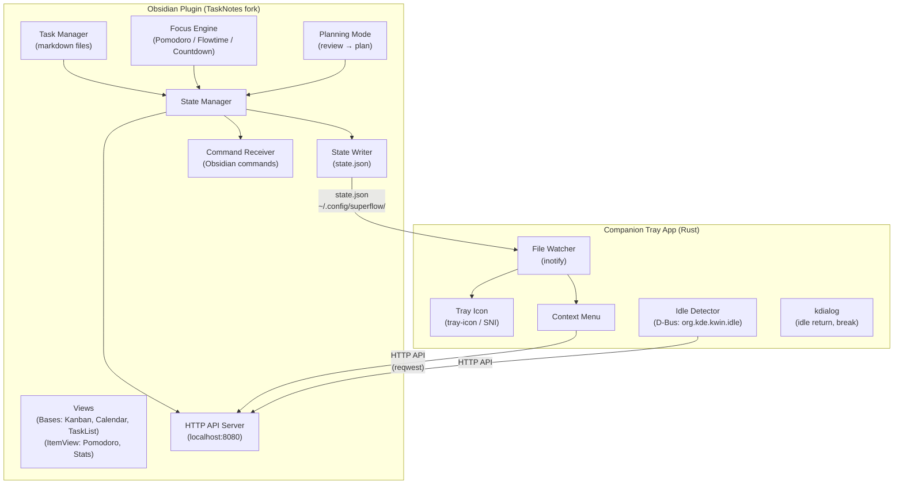
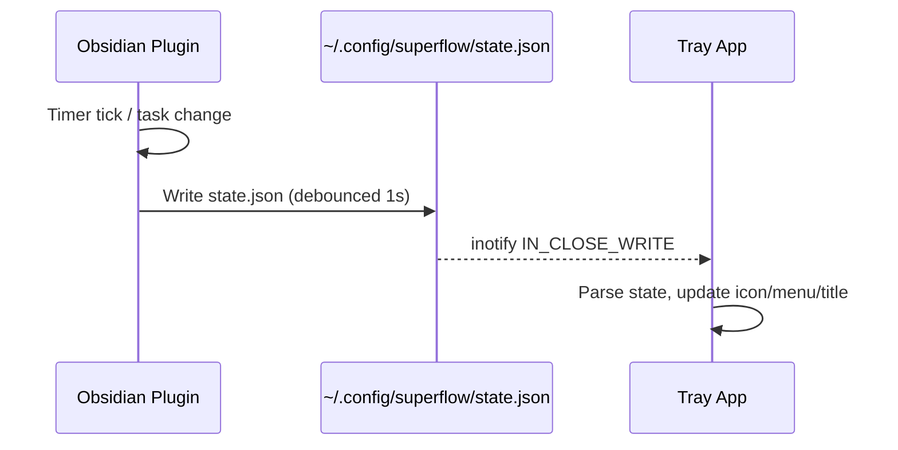
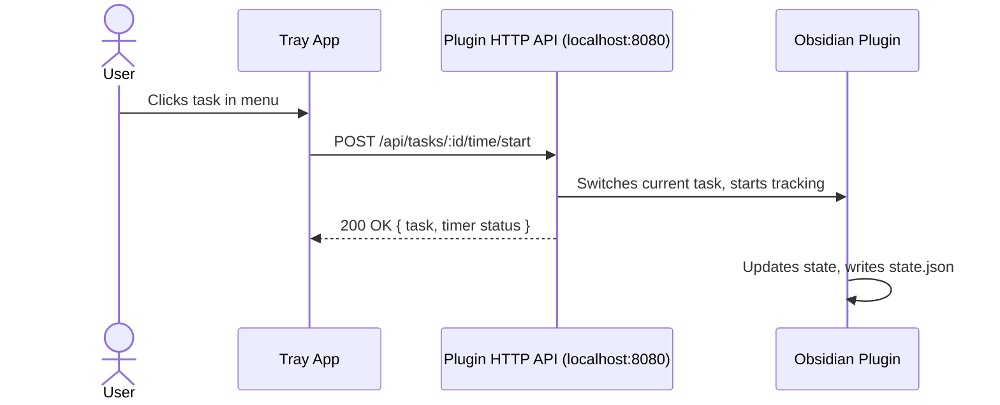

# Obsidian SuperFlow — Project Specification

> An Obsidian plugin (forked from TaskNotes) + Rust companion tray app that brings
> Super Productivity's time tracking, focus modes, daily planning, system tray
> integration, and anti-procrastination features into the Obsidian ecosystem —
> with tasks stored as plain markdown files.

**Author**: Caio
**Created**: 2026-02-27
**Revised**: 2026-02-28 (validated against TaskNotes v4.4.0 source, Obsidian CLI v1.12, and Wayland/KDE Plasma reality)
**Status**: Planning
**Base**: Fork of [TaskNotes](https://github.com/callumalpass/tasknotes) (MIT, v4.4.0)

---

## Table of Contents

1. [[#1. Vision & Goals]]
2. [[#2. Architecture Overview]]
3. [[#3. What TaskNotes Already Provides]]
4. [[#4. What We Add (Feature Gap)]]
5. [[#5. Data Model]]
6. [[#6. Companion Tray App]]
7. [[#7. Communication Architecture]]
8. [[#8. Development Workflow]]
9. [[#9. Implementation Roadmap]]
10. [[#10. Technical Constraints & Platform Notes]]
11. [[#11. References]]

---

## 1. Vision & Goals

### What We're Building

An Obsidian plugin that replicates the best of Super Productivity's workflow:

- **Task management** with time estimates, subtasks, tags, and project grouping (TaskNotes baseline)
- **Time tracking** with automatic per-task logging (TaskNotes baseline, enhanced)
- **Focus modes** — Pomodoro, Flowtime, Countdown (TaskNotes Pomodoro + new modes)
- **Daily planning** — "review yesterday → plan today" workflow (new)
- **System tray integration** via a Rust companion app — animated progress, task switching, idle detection (new)
- **Anti-procrastination** — break reminders, tracking nudges, work summaries (new)

### What We're NOT Building

- A full clone of SP — we leverage Obsidian's native strengths (notes, linking, search, themes)
- A cross-platform mobile app — Obsidian Mobile handles that
- Our own sync system — Obsidian Sync or git handles that
- A replacement for obsidian-tasks — we use the "task as note" paradigm
- Issue provider integrations (Jira/GitHub) — deferred, existing plugins cover this

### Core Principles

1. **Files are the source of truth** — all data lives in markdown + YAML frontmatter
2. **Obsidian-native** — use Obsidian's APIs, respect its conventions, play well with other plugins
3. **Extend, don't rewrite** — fork TaskNotes and add to it; don't strip or restructure
4. **Wayland-first** — design for KDE Plasma Wayland; X11 as fallback, not primary target
5. **Personal use first** — optimize for Caio's Linux desktop workflow, generalize later
6. **Incremental delivery** — each phase is independently useful

---

## 2. Architecture Overview



### Why Two Components?

Obsidian plugins run in Electron's **renderer process** — they cannot access:

- `electron.Tray` (main process only) — no system tray icons
- `electron.powerMonitor` (main process only) — no idle detection
- `electron.globalShortcut` (broken on Wayland regardless)

A companion tray app handles these. Both components communicate via:

- **Plugin → Tray**: `state.json` file (debounced writes, tray watches via inotify)
- **Tray → Plugin**: TaskNotes HTTP REST API (primary) or Obsidian CLI commands (fallback)

### Why Hybrid IPC?

| Direction | Mechanism | Why |
|---|---|---|
| Plugin → Tray | `state.json` file writes | Timer ticks need low-latency push; HTTP polling would add latency and load. inotify delivers in ~5ms. |
| Tray → Plugin | HTTP API (`localhost:8080`) | Rich JSON responses (task lists, timer status, stats), no process spawn overhead, no Catalyst license requirement. The tray app uses `reqwest` for HTTP calls. |
| Tray → Plugin (fallback) | Obsidian CLI (`obsidian command`) | Fallback for SuperFlow-specific commands not yet exposed via HTTP, or if the HTTP server is unavailable. Requires Catalyst license during early access. |

---

## 3. What TaskNotes Already Provides

These features exist in TaskNotes v4.4.0 and require **no modification**:

| Category | Features |
|---|---|
| **Task CRUD** | Create/edit/delete task notes with YAML frontmatter |
| **Statuses** | Configurable statuses (default: `open`, `in-progress`, `done`) |
| **Priorities** | Configurable priorities (default: `none`, `low`, `normal`, `high`) with sort weights |
| **Due & scheduled dates** | `due` and `scheduled` frontmatter fields |
| **Tags** | Obsidian tags in frontmatter, task identification via `task` tag |
| **Projects & contexts** | `projects` (wikilinks) and `contexts` (`@`-prefixed) lists |
| **Kanban board** | Bases-powered board view with swim lanes, drag-drop |
| **Calendar view** | FullCalendar-powered month/week/day/year/list views |
| **Task list view** | Filterable, sortable list via Bases |
| **Time tracking** | Start/stop per task, `timeEntries` with start/end timestamps |
| **Time estimates** | `timeEstimate` in minutes, rendered in views |
| **Pomodoro timer** | Web Worker timer, session history, break management, audio feedback |
| **Recurring tasks** | RFC 5545 RRULE, completion/skip tracking per instance |
| **Task dependencies** | 4 relationship types (FS/FF/SS/SF), gap offsets, visual decorations |
| **Reminders** | Absolute and relative reminders with ISO 8601 offsets |
| **NLP input** | `Buy groceries @budget due tomorrow !high` quick capture |
| **Calendar sync** | Google Calendar, Microsoft Calendar, ICS subscriptions |
| **Dark mode / themes** | Native Obsidian theming |
| **Keyboard shortcuts** | Native Obsidian command palette & hotkeys |

### TaskNotes View Architecture

| View | API | Registration |
|---|---|---|
| Task List | Obsidian Bases | `registerBasesView(plugin, "tasknotesTaskList", ...)` |
| Kanban | Obsidian Bases | `registerBasesView(plugin, "tasknotesKanban", ...)` |
| Calendar | Obsidian Bases + FullCalendar | `registerBasesView(plugin, "tasknotesCalendar", ...)` |
| Mini Calendar | Obsidian Bases | `registerBasesView(plugin, "tasknotesMiniCalendar", ...)` |
| Pomodoro Timer | Obsidian ItemView | `this.registerView("tasknotes-pomodoro-view", ...)` |
| Pomodoro Stats (sessions) | Obsidian ItemView | `this.registerView("tasknotes-pomodoro-stats-view", ...)` |
| Stats (overview) | Obsidian ItemView | `this.registerView("tasknotes-stats-view", ...)` |
| Release Notes | Obsidian ItemView | `this.registerView("tasknotes-release-notes", ...)` |

> **Note**: `registerBasesView()` is a free function from `src/bases/api.ts`, not a method on the plugin instance. ItemViews use the standard `this.registerView()` from `Plugin`.

> **Requirement**: Obsidian ≥ 1.10.1 (Bases API). This is a hard dependency.

---

## 4. What We Add (Feature Gap)

### Phase 1 — Enhanced Time Tracking

| Feature | What's Missing | Implementation |
|---|---|---|
| **Time estimate progress bars** | TaskNotes stores `timeEstimate` but unclear if visual progress is shown on cards | Render `totalTrackedTime / timeEstimate` as progress bar on Kanban cards and task list |
| **Overtime visual indicator** | No color shift when over estimate | Change progress bar color when `tracked > estimate` |
| **"Total time today" status bar** | No aggregate in status bar | Sum today's `timeEntries` across all tasks, display in status bar |
| **Checklist progress on cards** | No card-level visibility of internal checklists | Parse `- [x]` / `- [ ]` in task body, show "3/7" on Kanban card |

### Phase 2 — Focus Mode Overhaul

| Feature | What's Missing | Implementation |
|---|---|---|
| **Flowtime mode** | Only Pomodoro exists | New mode: free-form work, dynamic break suggestions based on work duration |
| **Countdown mode** | Only Pomodoro exists | Fixed countdown timer (no breaks) |
| **Session counter with long break cycle** | Unclear if TaskNotes tracks this | Every N work sessions → long break. Display session count. |
| **Break enforcement modal** | No break enforcement | Optional full-screen Obsidian modal during breaks |
| **Sync with tracking** | Unclear | Auto-start focus session when task tracking starts |

### Phase 3 — Daily Planning Mode

| Feature | What's Missing | Implementation |
|---|---|---|
| **Planning mode view** | Not present | Custom modal or sidebar view |
| **Review yesterday** | Not present | Show yesterday's completed + incomplete tasks |
| **Plan today** | Not present | Move incomplete tasks to today, pull from backlog |
| **Estimation prompt** | Not present | Prompt for `timeEstimate` on unestimated today tasks |
| **"Today" concept** | Uses `scheduled` date | Tasks with `scheduled: today` are "today's tasks" |
| **Trigger on vault open** | Not present | Configurable: show planning mode on first open of the day |

### Phase 4 — Companion Tray App

| Feature | What's Missing | Implementation |
|---|---|---|
| **System tray icon** | Cannot be done from plugin | Rust companion app with `tray-icon` crate (SNI/libappindicator) |
| **Animated tray progress** | Not possible from plugin | 16-frame icon cycle based on timer progress |
| **Tray context menu** | Not possible from plugin | Today's tasks as menu items, click to switch |
| **Tray title** | Not possible from plugin | Current task name + time remaining |
| **Idle detection** | Not possible from plugin | KDE D-Bus `org.kde.kwin.idle` via `zbus` crate |
| **"What did you do?" dialog** | Not possible from plugin | `kdialog` on idle return |
| **Break reminders** | Not possible from plugin (system-wide) | Desktop notification after configurable work threshold |

### Phase 5 — Anti-Procrastination & Summaries

| Feature | What's Missing | Implementation |
|---|---|---|
| **Take-a-break reminders** | Not present (system-wide) | Companion app monitors elapsed work time, sends notification |
| **Tracking reminder** | Not present | "No task tracked for X minutes" — status bar flash + tray notification |
| **Daily work summary** | Not present | View: tasks done today, time tracked, sessions completed |
| **Weekly summary** | Not present | Aggregate by project/tag, compare estimates vs actuals |

### Not Building (Tier 4 / Deferred)

| SP Feature | Why We Skip It |
|---|---|
| Issue provider integrations | Use existing Jira Sync plugin; defer to future phase |
| Custom sync | Obsidian Sync or git handles this |
| Electron window management | Obsidian handles this |
| PWA / mobile | Obsidian has native mobile apps |
| Global shortcuts | Broken on Wayland (Electron bug, wontfix). Use KDE system shortcuts instead. |

---

## 5. Data Model

### 5.1 Task Note Structure (Aligned with TaskNotes v4.4.0)

We use TaskNotes' existing frontmatter schema. **No field renames.** New fields are additive.

> **Note**: The canonical type is `TaskInfo` (`src/types.ts`), which contains the full field set. The narrower `TaskFrontmatter` interface is a base subset — fields like `blockedBy`, `reminders`, `recurrence_anchor`, and `skipped_instances` live in `TaskInfo` and are mapped to YAML via `FieldMapping`.

```yaml
---
# === TaskNotes standard fields ===
title: "Study Chapter 2: Matrices"
status: "in-progress"                     # open | in-progress | done (configurable)
priority: "high"                          # none | low | normal | high (configurable)
due: "2026-03-01"                         # YYYY-MM-DD
scheduled: "2026-02-28"                   # YYYY-MM-DD ("today" concept uses this)
completedDate: null                       # auto-set on completion
dateCreated: "2026-02-27T14:30:22Z"
dateModified: "2026-02-27T16:45:00Z"
tags:
  - task
  - linear-algebra
contexts:
  - "@study"
projects:
  - "[[Study Plan - Linear Algebra]]"
timeEstimate: 120                         # minutes (TaskNotes convention)
timeEntries:                              # TaskNotes time tracking format
  - startTime: "2026-02-27T14:30:22Z"
    endTime: "2026-02-27T15:15:22Z"
  - startTime: "2026-02-27T16:00:00Z"
    endTime: "2026-02-27T16:45:00Z"
recurrence: null                          # or RRULE string: "DTSTART:20260301;FREQ=WEEKLY"
recurrence_anchor: "scheduled"            # scheduled | completion
complete_instances: []
skipped_instances: []
blockedBy: []                             # TaskDependency objects
reminders: []                             # Reminder objects

# === SuperFlow additions (new fields) ===
issueLink: null                           # URL to external issue tracker (future)
---

# Study Chapter 2: Matrices

## Checklist
- [x] Read textbook sections 2.1-2.3
- [ ] Work through example problems
- [ ] Watch lecture recording
- [ ] Complete problem set

## Notes
Key insight: matrix multiplication is not commutative...
[[Linear Algebra Reference]]
```

### 5.2 Computed Properties (Runtime Only, Not Stored)

| Property | Derivation |
|---|---|
| `totalTrackedTime` | Sum of `timeEntries` durations |
| `efficiencyRatio` | `totalTrackedTime / timeEstimate` |
| `isOvertime` | `totalTrackedTime > timeEstimate` |
| `checklistProgress` | Parse `- [x]` and `- [ ]` in body |
| `isBlocked` | Any `blockedBy` task is not `done` |

### 5.3 Focus/Timer State

Stored in plugin `data.json` (not in task notes), following TaskNotes' existing pattern:

```typescript
interface SuperFlowFocusState {
  mode: 'pomodoro' | 'flowtime' | 'countdown';
  timer: {
    isRunning: boolean;
    startedAt: number | null;     // unix ms
    elapsed: number;              // ms
    duration: number;             // ms (for pomodoro/countdown; 0 for flowtime)
    purpose: 'work' | 'break' | null;
    isLongBreak: boolean;
  };
  session: {
    completedCount: number;
    cyclesBeforeLongBreak: number; // default: 4
  };
  currentTaskPath: string | null; // path to the task note being tracked
}
```

### 5.4 Planning Mode State

In-memory only (not persisted):

```typescript
interface PlanningState {
  isActive: boolean;
  step: 'review-yesterday' | 'plan-today' | 'estimate';
  yesterdayTasks: {
    completed: TaskInfo[];
    incomplete: TaskInfo[];
  };
  todayTasks: TaskInfo[];
  backlog: TaskInfo[];            // tasks with no scheduled date
}
```

### 5.5 State File (Plugin → Tray)

Written to `~/.config/superflow/state.json` on every state change (debounced, max 1 write/sec):

```jsonc
{
  "version": 1,
  "timestamp": 1709045122000,
  "currentTask": {
    "path": "TaskNotes/Tasks/Study Chapter 2.md",
    "title": "Study Chapter 2: Matrices",
    "totalTrackedTime": 5400000,    // ms
    "timeEstimate": 7200000,        // ms (120 min * 60 * 1000)
    "project": "Study Plan - Linear Algebra"
  },
  "timer": {
    "isRunning": true,
    "mode": "pomodoro",
    "purpose": "work",
    "elapsed": 720000,
    "duration": 1500000,
    "progress": 0.48,
    "sessionCount": 2
  },
  "todayTasks": [
    {
      "path": "TaskNotes/Tasks/Study Chapter 2.md",
      "title": "Study Chapter 2: Matrices",
      "timeEstimate": 7200000,
      "totalTrackedTime": 5400000,
      "status": "in-progress"
    }
  ],
  "settings": {
    "idleThresholdMs": 300000,
    "breakReminderMs": 3300000
  }
}
```

---

## 6. Companion Tray App

### 6.1 Technology Stack

| Component | Choice | Why |
|---|---|---|
| **Language** | Rust | Single binary (~3MB), no runtime deps, long-term reliability |
| **Tray icon** | `tray-icon` (tauri-apps) | Actively maintained (monthly releases), SNI/libappindicator backend, works on KDE Plasma Wayland |
| **D-Bus** | `zbus` crate | Pure Rust D-Bus implementation, no libdbus dependency |
| **File watching** | `notify` crate | Rust inotify wrapper, no artificial delay |
| **Dialogs** | `kdialog` (subprocess) | Native KDE/Qt/Breeze theming, already installed on Plasma |
| **Notifications** | `notify-rust` crate | D-Bus `org.freedesktop.Notifications`, native desktop notifications |
| **HTTP client** | `reqwest` crate | Calls TaskNotes HTTP API for tray → plugin communication (primary) |
| **CLI invocation** | `std::process::Command` | Calls `obsidian command ...` for SuperFlow-specific commands (fallback) |

### 6.2 Features

1. **Tray icon** — shows current state via SNI:
   - `stopped` icon — no task tracked
   - `running` → 16 animated frames — task in progress
   - Frame selection: `frame = floor(progress * 15)`

2. **Tray title** — current task name + time:
   - `"Study Ch2 — 18m remaining"` or `"Study Ch2 — 45m (+15m over)"`

3. **Context menu**:
   - Today's tasks (radio items, active = current)
   - Click → `POST /api/tasks/:id/time/start` (via HTTP API)
   - "Pause/Resume" → `POST /api/tasks/:id/time/stop` or `/time/start`
   - "Take a Break" → `obsidian command id=superflow:start-break` (SuperFlow-specific, CLI fallback)
   - "Show Obsidian" → `obsidian open`
   - "Quit"

4. **Idle detection** (KDE D-Bus):
   - Connect to `org.kde.kwin.idle` via `zbus`
   - Register idle timeout (configurable, default 5 min)
   - On idle: pause timer via `POST /api/pomodoro/pause` (HTTP API)
   - On resume: show `kdialog` with options:
     - "I was working on [current task]" → resume, keep time
     - "I was on break" → resume, discard idle time from task, log as break
     - "Discard idle time" → resume, subtract idle duration

5. **Break reminders**:
   - Track continuous work time from state.json
   - After threshold (default 55 min): send desktop notification
   - Optional: enforce break (block resume for N minutes)

6. **Auto-start**:
   - Plugin spawns companion app on load via `child_process.spawn()`
   - Or: systemd user service / XDG autostart

### 6.3 Project Structure

```
📁 superflow-tray/
  📄 Cargo.toml
  📁 src/
    📄 main.rs               ← entry point, file watcher + tray setup
    📄 tray.rs               ← tray icon, menu, animation
    📄 idle.rs               ← D-Bus idle detection (org.kde.kwin.idle)
    📄 state.rs              ← parse state.json, track work time
    📄 api_client.rs          ← HTTP client for TaskNotes REST API (reqwest)
    📄 commands.rs            ← invoke Obsidian CLI commands (fallback)
    📄 dialogs.rs            ← kdialog subprocess wrappers
    📄 notifications.rs      ← desktop notifications via D-Bus
  📁 icons/                  ← tray icons
    📄 stopped.png
    📁 frames/
      📄 frame-00.png ... frame-15.png
```

---

## 7. Communication Architecture

### 7.1 Plugin → Tray (state.json)



- Plugin writes state.json via Node.js `fs.writeFile()` (outside vault, allowed on desktop)
- Tray watches via Rust `notify` crate (inotify backend, ~5ms latency)
- Writes are atomic: write to `.state.json.tmp`, then `rename()` (prevents partial reads)

### 7.2 Tray → Plugin (HTTP API — Primary)



- Tray calls the plugin's HTTP API via `reqwest` (Rust HTTP client)
- Returns structured JSON — the tray app gets confirmation + updated state in one round-trip
- No process spawn overhead (unlike `obsidian command` which forks a process per call)
- No Catalyst license dependency for this communication path

### 7.3 TaskNotes HTTP API (Existing Endpoints)

The TaskNotes plugin already exposes a comprehensive REST API on `localhost` (default port `8080`, configurable). The tray app leverages these directly:

| Endpoint | Method | Purpose | Used By Tray |
|---|---|---|---|
| `/api/health` | GET | Connection test | Startup probe |
| `/api/tasks/query` | POST | Query/filter tasks (with filter DSL) | Context menu: today's tasks |
| `/api/tasks/:id` | GET | Get single task details | Task info display |
| `/api/tasks/:id/time/start` | POST | Start time tracking on a task | Switch-task action |
| `/api/tasks/:id/time/stop` | POST | Stop time tracking | Pause action |
| `/api/time/active` | GET | Get currently tracked task | Tray title |
| `/api/time/summary` | GET | Time summary (today/week) | Stats tooltip |
| `/api/pomodoro/start` | POST | Start pomodoro session | Focus mode |
| `/api/pomodoro/stop` | POST | Stop pomodoro | — |
| `/api/pomodoro/pause` | POST | Pause pomodoro | Idle detection |
| `/api/pomodoro/resume` | POST | Resume pomodoro | Idle return |
| `/api/pomodoro/status` | GET | Current pomodoro state | Tray icon animation |
| `/api/nlp/create` | POST | Create task via NLP text | Quick-add from tray (future) |

> **Auth**: Optional Bearer token, configurable in plugin settings. Stored in `~/.tasknotes-cli/config.json` format (same as tasknotes-cli).

### 7.4 Plugin Commands (Registered for CLI Fallback)

These Obsidian commands are registered for the command palette and as fallback for the tray app when HTTP API is unavailable. SuperFlow-specific commands (not covered by TaskNotes API) use this path until we extend the HTTP API.

| Command ID | Description | Payload |
|---|---|---|
| `superflow:switch-task` | Switch to a different task | `{ path: string }` |
| `superflow:toggle-timer` | Start/pause the current timer | — |
| `superflow:pause-timer` | Pause timer (idle detection) | — |
| `superflow:start-break` | Begin a break | — |
| `superflow:idle-return` | Handle return from idle | `{ action: "working" \| "break" \| "discard", idleDuration: number }` |
| `superflow:open-planning` | Open planning mode | — |

---

## 8. Development Workflow

The Obsidian CLI (v1.12+) enables a tight development loop:

```bash
# 1. Build the plugin
npm run build

# 2. Hot-reload in Obsidian (no restart needed)
obsidian plugin:reload id=obsidian-superflow

# 3. Check for errors
obsidian dev:errors

# 4. Verify DOM rendered
obsidian dev:dom selector=".superflow-progress-bar"

# 5. Visual regression screenshot
obsidian dev:screenshot path=tests/screenshots/kanban.png

# 6. Query task views programmatically
obsidian base:query path="TaskNotes/Views/today.base" --format json

# 7. Execute plugin commands manually
obsidian command id=superflow:toggle-timer

# 8. Debug via eval
obsidian eval code="app.plugins.plugins['obsidian-superflow'].focusState"
```

### Build Setup

- **Obsidian plugin**: TypeScript + esbuild (inherited from TaskNotes)
- **Companion tray app**: Rust + Cargo
- **Testing**: TaskNotes' existing Jest + Playwright suite as baseline

---

## 9. Implementation Roadmap

### Phase 0 — Foundation (Week 1)
> Goal: Fork TaskNotes, understand its architecture, set up dev environment.

- [ ] Fork TaskNotes repository
- [ ] Study codebase: services, views (Bases vs ItemView), data flow
- [ ] Set up dev environment with CLI hot-reload loop
- [ ] Verify all existing features work in your vault
- [ ] Document internal architecture (services, state management, view registration)
- [ ] Rename plugin to "Obsidian SuperFlow" (manifest, package.json, view IDs)

### Phase 1 — Enhanced Time Tracking (Week 2)
> Goal: Visual improvements to TaskNotes' existing time tracking.

- [ ] Add progress bar (tracked vs estimate) on Kanban cards
- [ ] Add overtime color indicator
- [ ] Add checklist progress indicator ("3/7") on cards
- [ ] Add "total time today" to status bar
- [ ] Register `superflow:*` commands for CLI access

### Phase 2 — Focus Mode Overhaul (Week 2-3)
> Goal: Add Flowtime and Countdown modes alongside existing Pomodoro.

- [ ] Refactor `PomodoroService` to support three modes
- [ ] Add Flowtime logic (dynamic break suggestions based on work duration)
- [ ] Add Countdown mode (fixed timer, no breaks)
- [ ] Add session counter with long break cycle
- [ ] Add break enforcement modal (optional Obsidian modal)
- [ ] Add "sync with tracking" — auto-start focus when task tracking starts
- [ ] Enhance status bar (mode, time remaining, session count)

### Phase 3 — Daily Planning Mode (Week 3-4)
> Goal: SP's "review yesterday → plan today" workflow.

- [ ] Create planning mode view (modal or ItemView sidebar)
- [ ] Step 1: Show yesterday's completed + incomplete tasks
- [ ] Step 2: Move incomplete tasks to today (set `scheduled: today`) or backlog (clear `scheduled`)
- [ ] Step 3: Pull tasks from backlog to today
- [ ] Step 4: Prompt for `timeEstimate` on unestimated today tasks
- [ ] Add configurable trigger on vault open

### Phase 4 — Companion Tray App (Week 4-6)
> Goal: System tray with task display, idle detection, break reminders.

- [ ] Scaffold Rust project with `tray-icon`, `zbus`, `notify`, `reqwest` crates
- [ ] Tray: implement HTTP API client (`api_client.rs`) for TaskNotes endpoints
- [ ] Plugin: write `state.json` to `~/.config/superflow/` on state changes
- [ ] Tray: watch `state.json`, display current task title/icon
- [ ] Tray: build context menu from today's tasks (via `POST /api/tasks/query`)
- [ ] Tray: invoke HTTP API on menu interactions (task switch, pause/resume)
- [ ] Tray: animated tray icon (16-frame progress)
- [ ] Tray: idle detection via `org.kde.kwin.idle` D-Bus interface
- [ ] Tray: "What did you do?" dialog via `kdialog` on idle return
- [ ] Tray: break reminder notifications via `org.freedesktop.Notifications`
- [ ] Plugin: spawn companion on load, or set up systemd user service

### Phase 5 — Anti-Procrastination & Polish (Week 6-7)
> Goal: Tracking nudges, work summaries, settings UI.

- [ ] Add tracking reminder (status bar flash + tray notification)
- [ ] Build daily summary view (tasks done, time tracked, sessions completed)
- [ ] Build weekly summary view (aggregate by project/tag)
- [ ] Add configurable settings tab in plugin settings
- [ ] End-to-end testing of full workflow

---

## 10. Technical Constraints & Platform Notes

### Obsidian Plugin API

| Can Do | Cannot Do |
|---|---|
| Read/write files in vault | Access Electron main process |
| Read/write files outside vault (Node.js `fs`) | Create system tray icons |
| Spawn child processes (`child_process`) | Register global shortcuts (broken on Wayland) |
| Create custom Bases views + ItemViews | Detect system idle |
| Add status bar items | Modify Obsidian's chrome |
| Register commands (palette + CLI accessible) | Use `@electron/remote` (disabled) |
| Play audio (`new Audio()`) | — |
| Show modals/notices | — |
| Send Web Notifications | — |

### Platform Requirements

| Requirement | Version / Detail |
|---|---|
| **Obsidian** | ≥ 1.10.1 (Bases API) |
| **Obsidian CLI** | ≥ 1.12 (Catalyst license during early access) |
| **OS** | Linux (CachyOS / Arch-based) |
| **Desktop** | KDE Plasma 6 (Wayland primary, X11 fallback) |
| **Rust** | Stable toolchain |
| **System deps** | `libappindicator-gtk3` or `libayatana-appindicator3` (tray), `kdialog` (dialogs) |

### Wayland Considerations

| Feature | X11 Approach | Wayland Approach | Status |
|---|---|---|---|
| Tray icon | XEmbed protocol | SNI via D-Bus (native on KDE Plasma) | Works |
| Idle detection | `xprintidle` | `org.kde.kwin.idle` D-Bus interface | Works (Plasma 6) |
| Global shortcuts | Electron `globalShortcut` | KDE system settings + `obsidian://` URI scheme | Workaround |
| Dialogs | `zenity` (GTK) | `kdialog` (Qt/Breeze, native) | Works |

### Plugin Store Compatibility

Spawning external processes is **allowed** in the Obsidian community store with:
- `isDesktopOnly: true` in `manifest.json`
- README disclosure of filesystem access and process spawning
- No code obfuscation

### Known Risks

| Risk | Mitigation |
|---|---|
| **TaskNotes is 96% single-author** — deep knowledge concentrated | Fork-and-extend preserves all code; comprehensive test suite (457 files) provides regression safety |
| **Bases API is relatively new** (Obsidian 1.10.1+) | Hard requirement, documented. Most users on recent Obsidian. |
| **Obsidian CLI requires Catalyst license** (early access) | Tray app uses HTTP API as primary communication — CLI is only needed for SuperFlow-specific commands and the dev workflow. Planned to become free. Caio already has it. |
| **tray-icon crate**: icon may not show without menu on Wayland | Set an empty menu on startup (known workaround from Tauri issues) |
| **SNI boot race on KDE**: apps registering before plasmashell loads | Delay SNI registration by 2s on startup, or retry on failure |

---

## 11. References

### TaskNotes Source (Fork Base)

| Area | File/Path |
|---|---|
| Task frontmatter schema | `src/types.ts` (`TaskFrontmatter`, `TaskInfo`, `FieldMapping`) |
| Task service | `src/services/TaskService.ts` |
| Pomodoro service | `src/services/PomodoroService.ts` |
| Time tracking | `src/utils/` (`computeActiveTimeSessions`, `computeTimeSummary`) |
| Dependency utils | `src/utils/dependencyUtils.ts` |
| Bases views | `src/bases/` (KanbanView, CalendarView, TaskListView) |
| ItemViews | `src/views/` (PomodoroView, PomodoroStatsView) |
| Settings/defaults | `src/settings/defaults.ts` |
| Field mapping | `src/settings/defaults.ts` (`DEFAULT_FIELD_MAPPING`) |
| RRULE handling | `src/utils/rruleConverter.ts` |
| Test suite | `tests/`, `e2e/` (Jest + Playwright) |

### Super Productivity Source (Feature Reference)

| Area | File |
|---|---|
| Focus mode model | `src/app/features/focus-mode/focus-mode.model.ts` |
| Planning mode | `src/app/features/planning-mode/` |
| Take a break | `src/app/features/take-a-break/` |
| Electron tray | `electron/indicator.ts` |
| IPC events | `electron/shared-with-frontend/ipc-events.const.ts` |

### Obsidian Resources

| Resource | URL |
|---|---|
| Plugin API docs | https://docs.obsidian.md/Plugins |
| Developer policies | https://docs.obsidian.md/Developer+policies |
| Plugin guidelines | https://docs.obsidian.md/Plugins/Releasing/Plugin+guidelines |
| CLI docs | https://help.obsidian.md/cli |
| Bases API | Obsidian ≥ 1.10.1 (registerBasesView) |

### Companion App Crates

| Crate | Purpose | URL |
|---|---|---|
| `tray-icon` | System tray (SNI/AppIndicator) | https://github.com/tauri-apps/tray-icon |
| `zbus` | D-Bus client (idle detection, notifications) | https://github.com/dbus2/zbus |
| `notify` | File watching (inotify) | https://github.com/notify-rs/notify |
| `notify-rust` | Desktop notifications | https://github.com/hoodie/notify-rust |
| `reqwest` | HTTP client for TaskNotes REST API | https://github.com/seanmonstar/reqwest |

---

## Research Notes

The research that led to this specification is archived at:
`CodeProjects/obsidian-superflow/research-notes/`

| # | Topic | Key Finding |
|---|---|---|
| 01 | Can we merge SP and Obsidian? | Native plugin approach chosen over bridge |
| 02 | Why Obsidian can't access system tray | Electron renderer process limitations confirmed |
| 03 | Architecture: companion tray app | Two-component design with file-based IPC |
| 04 | SP feature audit & ecosystem | 50+ SP features cataloged; TaskNotes identified as fork base |
| 05 | TaskNotes vs obsidian-tasks | Different paradigms; TaskNotes alone is sufficient |
| 06 | Study plans in task-as-note paradigm | Option C (one task note with checklist body) recommended |
